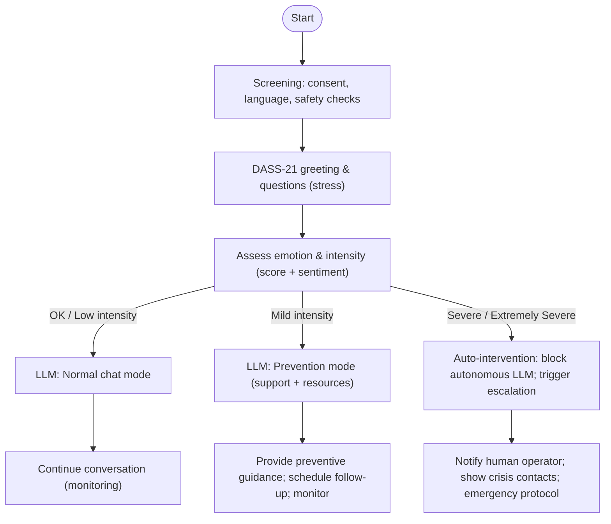

# Pre-LLM Screening & Gating

## Purpose
Gate user conversations before invoking the LLM: perform consent, safety, and DASS-21 screening; determine emotion intensity; route to appropriate handling mode (normal, prevention, or intervention).

## Mermaid Flow



## DASS-21 Stress thresholds (suggested, configurable)
- Raw DASS-21 Stress score → severity band:
  - Normal: 0–7
  - Mild: 8–9
  - Moderate: 10–12
  - Severe: 13–16
  - Extremely severe: 17+

Adjust these thresholds in configuration if you want different sensitivity.

## Backend Implementation Notes
- Endpoint: `POST /api/screening` — accepts `{ consent, language, dass21_answers, metadata }` and returns `{ action, score, band, message, resources }`.
- Middleware: add a pre-LLM middleware that calls `/api/screening` and enforces returned `action` before forwarding any prompt to the LLM.
- Actions:
  - `allow` — permit normal LLM chat (monitor continuously).
  - `prevention` — allow LLM but restrict to supportive, preventive templates and include resources; mark session as monitored.
  - `intervention` — block LLM; escalate to human operator; return crisis resources and contact options.
- Logging: persist `score`, `band`, `decision`, `timestamp`, and `user_id` (if available) for auditing and human review.
- Human override: provide API for operators to change session `action` and add notes.
- Security & Privacy: store DASS responses encrypted at rest; retain only what's necessary per your retention policy.

## Integration points
- Place controller under `RadAI/Backend/src/main/java/...` as `PreLLMScreeningController` and middleware as `PreLLMFilter` (or equivalent Spring `HandlerInterceptor`).
- Use existing user/session store to link screening results to the active chat session.

## Quick example pseudocode (server)

```
// POST /api/screening
computeScore = sum(dass21_answers)
band = mapScoreToBand(computeScore)
if band in [Severe, Extremely severe]:
  action = 'intervention'
elif band == Mild:
  action = 'prevention'
else:
  action = 'allow'
return { action, score: computeScore, band }
```

---
File created to provide the design and integration guidance for backend teams.
