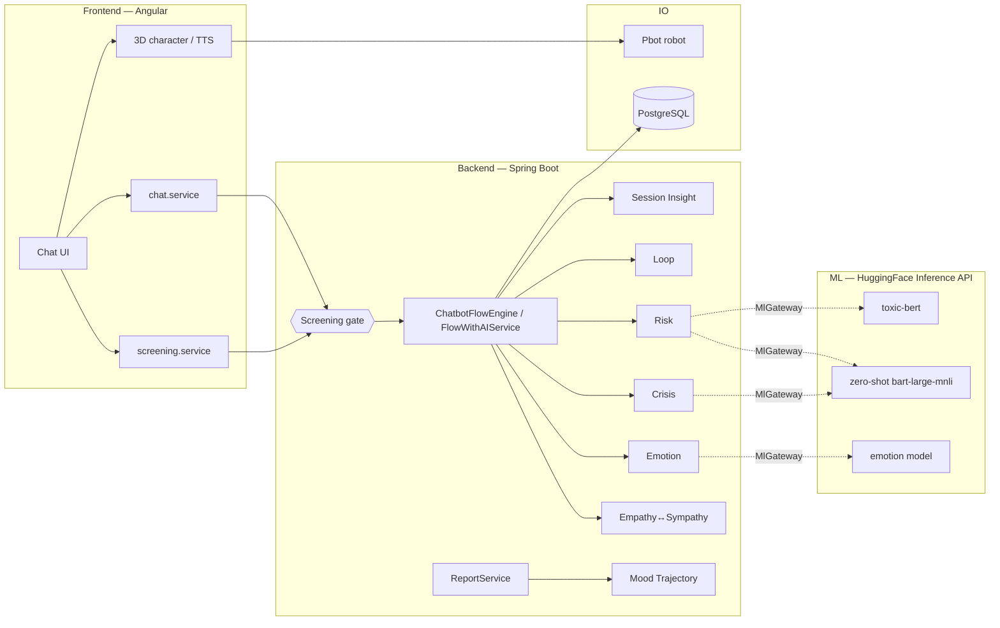
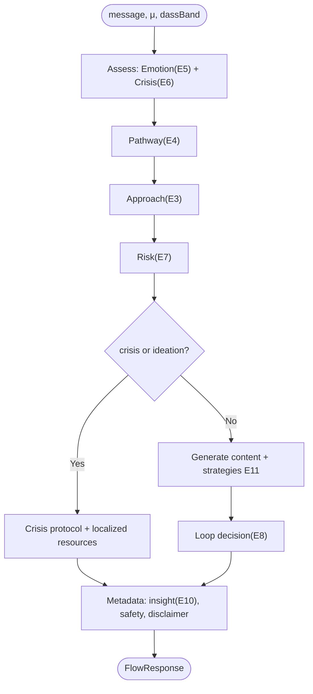
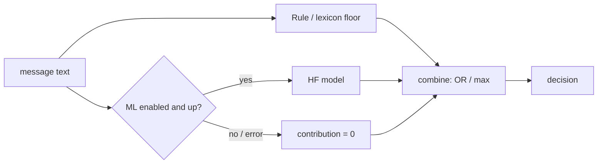

# RAD — System Documentation & Engine Mathematics

**RAD (Reassuring Affective Domain)** — an adaptive, affect-aware mental-wellbeing chatbot (Angular + Spring Boot + a physical Pbot robot). This document is the single reference for the whole system and gives the **formal mathematics of every decision/calculation engine**.

> ⚠️ **Positioning.** RAD is a *supportive / psychoeducational prototype*, **not** a clinically validated therapy or crisis service. All classifiers are ML-primary with deterministic keyword floors; see [§13 Limitations](#13-limitations--safety-notes).

---

## Table of contents

1. [Notation & symbols](#1-notation--symbols)
2. [Architecture](#2-architecture)
3. [Per-message pipeline](#3-per-message-pipeline)
4. [Engine 1 — DASS-21 Screening](#4-engine-1--dass-21-screening)
5. [Engine 2 — Intensity Level](#5-engine-2--intensity-level)
6. [Engine 3 — Empathy ↔ Sympathy Switch](#6-engine-3--empathy--sympathy-switch-core-mechanic)
7. [Engine 4 — Pathway](#7-engine-4--pathway)
8. [Engine 5 — Emotion Scoring (ML + lexicon)](#8-engine-5--emotion-scoring-ml-primary--lexicon-floor)
9. [Engine 6 — Crisis Detection (ML + keyword floor)](#9-engine-6--crisis-detection-ml-primary--keyword-floor)
10. [Engine 7 — Risk Assessment (ML + keyword floor)](#10-engine-7--risk-assessment-ml-primary--keyword-floor)
11. [Engine 8 — Loop Manager](#11-engine-8--loop-manager)
12. [Engine 9 — Mood Trajectory (regression)](#12-engine-9--mood-trajectory-regression)
13. [Engine 10 — Session Insight](#13-engine-10--session-insight)
14. [Engine 11 — Coping-Strategy Recommender](#14-engine-11--coping-strategy-recommender)
15. [Engine 12 — Character Expression](#15-engine-12--character-expression)
16. [Engine 13 — Report / Analytics](#16-engine-13--report--analytics)
17. [ML fusion & the safety invariant](#17-ml-fusion--the-safety-invariant)
18. [Configuration (application.properties)](#18-configuration-applicationproperties)
19. [Constant summary](#19-constant-summary)
20. [Limitations & safety notes](#20-limitations--safety-notes)

---

## 1. Notation & symbols

| Symbol | Meaning |
|---|---|
| $S$ | DASS-21 raw score (sum of item answers) |
| $b$ | DASS band $\in\{$Normal, Mild, Moderate, Severe, Extremely severe$\}$ |
| $\beta(b)$ | band → baseline map (0–10) |
| $\mu$ | per-message intensity, $\mu\in[0,10]$ |
| $\bar\mu$ | clamped intensity $\mathrm{clamp}(\mu,0,10)$ |
| $\sigma$ | combined empathy/sympathy signal (0–10) |
| $w_\beta, w_\mu$ | band / message blend weights |
| $\tau_H, \tau_L$ | high / low switch cut-offs |
| $A$ | approach state, $A\in\{E,S\}$ (Empathy / Sympathy) |
| $L$ | intensity level $\in\{$LOW, MODERATE, HIGH$\}$ |
| $P$ | pathway $\in\{$PREVENTION, INTERVENTION$\}$ |
| $\mathrm{Sc}(e)$ | lexicon score of emotion $e$; $\kappa$ = confidence |
| $s_{\text{ml}}, \ell$ | ML emotion score / label; $\theta_e$ = accept threshold |
| $p_{\text{id}}, p_{\text{cr}}$ | ML zero-shot ideation / crisis probabilities |
| $\theta_{\text{id}}, \theta_{\text{cr}}$ | ML ideation / crisis thresholds |
| $r$ | rule-based risk score; $m$ = ML risk; $\rho$ = final risk |
| $\theta_{\text{crit}},\theta_{\text{high}},\theta_{\text{mod}}$ | risk level cut-offs |
| $\tau_{\text{tox}}$ | toxicity score from safety model |
| $\hat\beta_0,\hat\beta_1$ | regression intercept / slope (mood trajectory) |
| $R^2$ | coefficient of determination |
| $\nu, \nu^\ast$ | trajectory volatility / volatility threshold |
| $\theta_s$ | trajectory slope threshold |
| $\Delta$ | per-cycle improvement % (Loop) |
| $\Pi$ | within-session improvement % (Insight) |
| $c, C_{\max}$ | cycle count / max cycles (=15) |
| $d$ | session duration (minutes) |
| $\mathbb{1}[\cdot]$ | indicator (1 if true, else 0) |
| $\mathrm{clamp}(x,a,b)$ | $\max(a,\min(b,x))$ |

---

## 2. Architecture

**ML bridge.** Engines are plain Java (Spring-free, unit-testable). `MlGateway` is a static, **fail-safe**, per-text-**cached** bridge; `MlGatewayInitializer` wires `HuggingFaceClient` in at startup when `radai.ml.enabled` **and** a token are present.

---

## 3. Per-message pipeline

---

## 4. Engine 1 — DASS-21 Screening

`PreLLMScreeningController` — pre-chat gate for anonymous users.

**Raw score** over item answers $a_i\in\{0,1,2,3\}$:

$$S=\sum_{i} a_i$$

**Band** (thresholds $8,10,13,17$):

$$
b(S)=
\begin{cases}
\text{Extremely severe} & S\ge 17\\
\text{Severe} & 13\le S\le 16\\
\text{Moderate} & 10\le S\le 12\\
\text{Mild} & 8\le S\le 9\\
\text{Normal} & S\le 7
\end{cases}
$$

**Action** (gate):

$$
\text{act}(b)=
\begin{cases}
\text{intervention} & b\in\{\text{Severe, Extremely severe}\}\quad(\text{LLM blocked})\\
\text{prevention} & b\in\{\text{Mild, Moderate}\}\\
\text{allow} & b=\text{Normal}
\end{cases}
$$

> **Fix applied:** *Moderate* previously fell through to `allow`; it now maps to `prevention`.

**Character intensity** (map $S\in[0,63]$ → $[1,10]$, integer division as in code):

$$
I=\mathrm{clamp}\!\left(\left\lfloor \tfrac{9S}{63}\right\rfloor+1,\;1,\;10\right)
$$

**Emotion from band:** Severe/Extremely severe → `STRESSED`; Moderate → `ANXIOUS`; Mild → `UNDERSTANDING`; Normal → `NEUTRAL`.

---

## 5. Engine 2 — Intensity Level

`IntensityLevel.fromScore` — quantise $\mu\in[0,10]$:

$$
L(\mu)=
\begin{cases}
\text{LOW} & \mu\le 4\\
\text{MODERATE} & 5\le\mu\le 7\\
\text{HIGH} & \mu\ge 8
\end{cases}
$$

---

## 6. Engine 3 — Empathy ↔ Sympathy Switch *(core mechanic)*

`ApproachSwitchPolicy`. **High** stress → Sympathy (step-in guidance); **Low** → Empathy (presence). Hysteresis prevents flip-flopping.

**Band baseline:**

$$
\beta(b)=
\begin{cases}
1 & \text{Normal}\\ 3 & \text{Mild}\\ 5 & \text{Moderate}\\ 7 & \text{Severe}\\ 9 & \text{Extremely severe}\\ -1 & \text{unknown}
\end{cases}
$$

**Combined signal** (blend of stable baseline and live intensity; defaults $w_\beta=w_\mu=0.5$):

$$
\sigma=
\begin{cases}
w_\beta\,\beta(b)+w_\mu\,\bar\mu & \beta(b)\ge 0\\[4pt]
\bar\mu & \beta(b)<0
\end{cases}
\qquad \bar\mu=\mathrm{clamp}(\mu,0,10)
$$

**Decision** with cut-offs $\tau_H=7,\ \tau_L=4$ and incoming state $A_{\text{prev}}$ (priority top-down):

$$
A=
\begin{cases}
S & \text{crisis} \quad(\text{override})\\
E & \text{first turn}\\
S & \sigma\ge\tau_H\\
E & \sigma\le\tau_L\\
A_{\text{prev}} & \tau_L<\sigma<\tau_H \quad(\text{dead-zone: hold})
\end{cases}
$$

The dead-zone $(\tau_L,\tau_H)$ yields the four verified outcomes: switch $E\!\to\!S$, switch $S\!\to\!E$, stay $E$, stay $S$.

---

## 7. Engine 4 — Pathway

`MonitoringAndScreeningService.determinePathway`:

$$
P(L)=
\begin{cases}
\text{PREVENTION} & L=\text{LOW}\\
\text{INTERVENTION} & L\in\{\text{MODERATE},\text{HIGH}\}
\end{cases}
$$

Escalation $\text{PREVENTION}\to\text{INTERVENTION}$ is performed later by the Loop engine (§11) and resets $A\leftarrow E$.

---

## 8. Engine 5 — Emotion Scoring (ML-primary + lexicon floor)

`EmotionScoringEngine`. Let $t$ be the lowercased message and $K_e$ the keyword set for emotion $e$ with weights $w_{e,k}$.

**Lexicon score** and confidence:

$$
\mathrm{Sc}(e)=\sum_{k\in K_e} w_{e,k}\,\mathbb{1}[k\subseteq t],
\qquad
T=\sum_{e}\mathrm{Sc}(e)
$$

$$
e^\ast_{\text{lex}}=\arg\max_e \mathrm{Sc}(e),
\qquad
\kappa=\frac{\mathrm{Sc}(e^\ast_{\text{lex}})}{T}
$$

If $T=0$: emotion $=$ `neutral`, $\kappa=0.3$. Crisis words (`hopeless`) carry weight $\ge 4$ so they dominate.

**ML fusion.** Model returns $(\ell, s_{\text{ml}})$; label map $M(\cdot)$: `anger,disgust`→anger, `fear`→anxiety, `joy`→joy, `sadness`→sadness, else→neutral. With $\theta_e=0.5$:

$$
e^\ast=
\begin{cases}
\text{`hopeless`} & e^\ast_{\text{lex}}=\text{`hopeless`}\quad(\text{safety floor})\\[3pt]
M(\ell) & s_{\text{ml}}\ge\theta_e \ \wedge\ \lnot\big(M(\ell)=\text{neutral}\wedge e^\ast_{\text{lex}}\ne\text{neutral}\big)\\[3pt]
e^\ast_{\text{lex}} & \text{otherwise (ML unavailable/low/neutral-guard)}
\end{cases}
$$

---

## 9. Engine 6 — Crisis Detection (ML-primary + keyword floor)

`CrisisDetectionEngine`. **Recall-focused**: a false negative is worse than a false positive.

**Rule categories** (indicators over EN + Malay lexicons) — explicit suicide $x_e$, passive ideation $x_p$, self-harm $x_s$, safety concern $x_f$, distress $x_d$, each $\in\{0,1\}$.

**ML zero-shot** (`bart-large-mnli`, multi-label) gives $p_{\text{id}}$ (ideation) and $p_{\text{cr}}$ (crisis/distress). With $\theta_{\text{id}}=0.60,\ \theta_{\text{cr}}=0.65$:

$$
\text{ml}_{\text{id}}=\mathbb{1}[p_{\text{id}}\ge\theta_{\text{id}}],
\qquad
\text{ml}_{\text{cr}}=\mathbb{1}[p_{\text{id}}<\theta_{\text{id}}\ \wedge\ p_{\text{cr}}\ge\theta_{\text{cr}}]
$$

**Fusion (OR — floor preserving):**

$$
\text{ideation}=x_e\vee x_p\vee x_s\vee x_f\vee \text{ml}_{\text{id}}
$$

$$
\text{crisis}=\text{ideation}\vee x_d\vee \text{ml}_{\text{cr}}
$$

**Severity & confidence** (priority top-down):

$$
(\text{sev},\text{conf})=
\begin{cases}
(\text{CRISIS},\,0.95) & x_e\vee x_s\\
(\text{CRISIS},\,\max(0.75,p_{\text{id}})) & \text{ml}_{\text{id}}\\
(\text{CRISIS},\,0.75) & x_p\\
(\text{CRISIS},\,\max(0.65,p_{\text{cr}})) & x_f\vee \text{ml}_{\text{cr}}\\
(\text{ELEVATED},\,0.50) & x_d\\
(\text{NONE},\,0) & \text{otherwise}
\end{cases}
$$

If ML is unavailable or errors, $p_{\text{id}}=p_{\text{cr}}=0$ and the result is exactly the rule-based classification.

---

## 10. Engine 7 — Risk Assessment (ML-primary + keyword floor)

`RiskAssessmentEngine`. Additive **rule score** with weights $(0.7,0.2,0.2,0.4)$, crisis-language floor $0.9$:

$$
r = 0.7\,n_{\text{crisis}} + 0.2\,n_{\text{highrisk}} + 0.2\,\mathbb{1}[\mu\ge 8] + 0.4\,\mathbb{1}[\text{ctx}]
$$

$$
r \leftarrow \max\big(r,\ 0.9\cdot \mathbb{1}[\text{crisis-regex}]\big)
$$

where $n_{\text{crisis}},n_{\text{highrisk}}$ are trigger counts and $\text{ctx}$ = context already flagged.

**ML risk signal** (shared/cached zero-shot + toxicity $\tau_{\text{tox}}$):

$$
m=\max\!\Big(
\underbrace{p_{\text{id}}\,\mathbb{1}[p_{\text{id}}\ge\theta_{\text{id}}]}_{\text{ideation}},\;
\underbrace{0.9\,p_{\text{cr}}\,\mathbb{1}[p_{\text{id}}<\theta_{\text{id}}\wedge p_{\text{cr}}\ge\theta_{\text{cr}}]}_{\text{distress}},\;
\underbrace{0.5\,\tau_{\text{tox}}\,\mathbb{1}[\tau_{\text{tox}}\ge 0.85]}_{\text{toxicity}}
\Big)
$$

**Final risk (max-combine — ML only raises):**

$$
\rho=\min\big(1,\ \max(r,m)\big)
$$

**Level** ($\theta_{\text{crit}}=0.8,\ \theta_{\text{high}}=0.45,\ \theta_{\text{mod}}=0.2$):

$$
\text{lvl}(\rho)=
\begin{cases}
\text{critical} & \rho\ge 0.8\ (\Rightarrow \text{crisis})\\
\text{high} & 0.45\le\rho<0.8\\
\text{moderate} & 0.2\le\rho<0.45\\
\text{low} & \rho<0.2
\end{cases}
$$

**Margin confidence.** For the band $[\lambda_{\text{lo}},\lambda_{\text{hi}}]$ containing $\rho$ (bounds from $\{0,0.2,0.45,0.8,1\}$):

$$
\kappa=\mathrm{clamp}\!\left(0.5+0.5\cdot\frac{\min(\rho-\lambda_{\text{lo}},\,\lambda_{\text{hi}}-\rho)}{(\lambda_{\text{hi}}-\lambda_{\text{lo}})/2},\ 0.5,\ 1\right)
$$

$\kappa=0.5$ on a boundary → $1.0$ at a band centre.

---

## 11. Engine 8 — Loop Manager

`LoopManager.makeLoopDecision`, evaluated once per cycle; $C_{\max}=15$.

**Per-cycle improvement** ($\mu_{\text{prev}}$ = previous intensity):

$$
\Delta=
\begin{cases}
\dfrac{\mu_{\text{prev}}-\mu_{\text{cur}}}{\mu_{\text{prev}}}\times 100 & \mu_{\text{prev}}>0\\[8pt]
0 & \mu_{\text{prev}}=0
\end{cases}
$$

**Exit predicate** ($d$ = minutes, $c$ = cycle):

$$
\text{exit}=\big(L=\text{LOW}\wedge\text{improving}\wedge c\ge 2\big)\ \vee\ \big(\mu\le 3\wedge c\ge 3\big)\ \vee\ (d>30)
$$

**Decision** (priority top-down):

$$
\text{action}=
\begin{cases}
\text{EXIT} & \text{exit}\\
\text{ESCALATE\_PROFESSIONAL} & c\ge C_{\max}\\
\text{CONTINUE} & \text{improving}\wedge \mu\le 4\\
\text{SWITCH\_APPROACH} & \lnot\text{responding}\ \vee\ n_{\text{noimprove}}\ge 2\\
\text{ESCALATE\_PATHWAY} & P=\text{PREVENTION}\wedge \mu\uparrow\\
\text{ESCALATE\_CRISIS} & \text{crisis}\\
\text{CONTINUE} & \text{otherwise}
\end{cases}
$$

`SWITCH_APPROACH` sets $A\leftarrow \overline{A}$; `ESCALATE_PATHWAY` sets $P\leftarrow$ INTERVENTION, $A\leftarrow E$.

---

## 12. Engine 9 — Mood Trajectory (regression)

`MoodTrajectoryEngine`. Ordered intensities $y_0,\dots,y_{n-1}$ (oldest→newest), $x_i=i$. Requires $n\ge$ `minSamples` $=3$, else `INSUFFICIENT_DATA`.

Means: $\bar x=\tfrac{n-1}{2},\ \bar y=\tfrac1n\sum_i y_i$.

**Ordinary least squares:**

$$
\hat\beta_1=\frac{\sum_i (i-\bar x)(y_i-\bar y)}{\sum_i (i-\bar x)^2},
\qquad
\hat\beta_0=\bar y-\hat\beta_1\bar x
$$

**Goodness of fit ($=$ confidence for linear trends):**

$$
R^2=1-\frac{SS_{\text{res}}}{SS_{\text{tot}}}
=1-\frac{\sum_i\big(y_i-(\hat\beta_0+\hat\beta_1 i)\big)^2}{\sum_i (y_i-\bar y)^2}
\qquad(R^2=1\ \text{if}\ SS_{\text{tot}}=0)
$$

**Volatility** (std-dev of successive deltas $\delta_i=y_i-y_{i-1}$):

$$
\nu=\sqrt{\frac{1}{n-1}\sum_{i=1}^{n-1}\big(\delta_i-\bar\delta\big)^2}
$$

**Trend** ($\theta_s=0.3,\ \nu^\ast=2.5$; note falling intensity = improving):

$$
\text{trend}=
\begin{cases}
\text{VOLATILE} & \nu\ge \nu^\ast\quad(\text{conf}=\min(1,\ \nu/2\nu^\ast))\\
\text{IMPROVING} & \hat\beta_1\le -\theta_s\quad(\text{conf}=R^2)\\
\text{WORSENING} & \hat\beta_1\ge +\theta_s\quad(\text{conf}=R^2)\\
\text{STABLE} & |\hat\beta_1|<\theta_s\quad(\text{conf}=R^2)
\end{cases}
$$

**Forecast** (one step ahead, clamped):

$$
\hat y_{n}=\mathrm{clamp}\big(\hat\beta_0+\hat\beta_1\,n,\ 0,\ 10\big)
$$

---

## 13. Engine 10 — Session Insight

`SessionInsightEngine`. Opening intensity $\mu_0$, current $\mu_c$:

$$
\Pi=
\begin{cases}
\dfrac{\mu_0-\mu_c}{\mu_0}\times 100 & \mu_0>0\\[8pt]
0 & \mu_0\le 0
\end{cases}
$$

**Status** (thresholds $\Pi^{+}=20,\ \Pi^{-}=-20$; $\mu$ cut-offs $8,4$):

$$
\text{status}=
\begin{cases}
\text{CRISIS} & \text{crisis flag}\\
\text{IMPROVED} & \Pi\ge 20\ \wedge\ \mu_c\le 4\\
\text{WORSENED} & \Pi\le -20\ \vee\ \mu_c\ge 8\\
\text{STABLE} & \text{otherwise}
\end{cases}
$$

---

## 14. Engine 11 — Coping-Strategy Recommender

`CopingStrategyEngine`. For strategy $j$ with emotion tags $\mathcal E_j$, stressor tags $\mathcal S_j$, intensity band $[\underline{I}_j,\overline{I}_j]$; current $(e,s,\mu)$; weights $w_0=0.5,\ w_e=2.0,\ w_s=1.5,\ w_I=1.0$, penalty $\pi=0.25$:

$$
\text{score}_j=w_0
+ w_e\,\mathbb{1}[e\in\mathcal E_j\ \text{or ANY}]
+ w_s\,\mathbb{1}[s\in\mathcal S_j\ \text{or ANY}]
+
\begin{cases}
w_I & \underline{I}_j\le\mu\le\overline{I}_j\\
-\pi\,\text{dist} & \text{otherwise}
\end{cases}
$$

where $\text{dist}=\max(\underline{I}_j-\mu,\ \mu-\overline{I}_j)$. **Relevance** normalises to $[0,1]$:

$$
\text{rel}_j=\mathrm{clamp}\!\left(\frac{\text{score}_j}{w_0+w_e+w_s+w_I},\ 0,\ 1\right)
$$

Return top-$N$ by descending score.

---

## 15. Engine 12 — Character Expression

`CharacterIntegrationController` — deterministic maps (no arithmetic):

$$
\text{expr}=\Phi(\text{emotion}),\qquad \text{anim}=\Psi(\text{sentiment}(t))
$$

e.g. $\Phi:$ `sad`→sad, `anxious`→funnyFace, `afraid`→terrified; $\Psi:$ positive→Laughing, questioning→Talking_0, concerned→Idle. Emotion + intensity are also streamed to the Pbot robot.

---

## 16. Engine 13 — Report / Analytics

`ReportService` over history $H=\{(t_i,\mu_i,\text{sent}_i,e_i)\}$:

$$
\bar\mu=\frac1{|H|}\sum_i \mu_i,\qquad
\overline{\text{sent}}=\frac1{|H|}\sum_i \text{sent}_i,\qquad
e^\ast=\operatorname{mode}\{e_i\}
$$

plus the emotion distribution $\{(e,\#e)\}$, the last-24 intensity trend, and the **Mood Trajectory** block (§12).

---

## 17. ML fusion & the safety invariant

All ML runs through `MlGateway` (cached, fail-safe). The **invariant** across crisis (§9) and risk (§10):

$$
\text{flag}_{\text{final}}=\text{flag}_{\text{rule}}\ \vee\ \text{flag}_{\text{ml}},
\qquad
\rho_{\text{final}}=\max(\rho_{\text{rule}},\ \rho_{\text{ml}})
$$

> **ML is monotone-increasing on safety: it can only *add* a flag or *raise* risk, never lower the deterministic keyword floor.** If the model is disabled, times out, rate-limits, or throws, every ML term collapses to $0$ and each engine degrades exactly to its rule/lexicon behaviour. This also preserves **Malay** recall (models are English-only; the keyword floor covers Malay).

---

## 18. Configuration (application.properties)

All numeric knobs are externalised (`EngineProperties` → `EngineTuning`); defaults reproduce original behaviour.

| Property | Symbol | Default |
|---|---|---|
| `radai.engine.approach.high-cut` | $\tau_H$ | 7.0 |
| `radai.engine.approach.low-cut` | $\tau_L$ | 4.0 |
| `radai.engine.approach.band-weight` | $w_\beta$ | 0.5 |
| `radai.engine.approach.message-weight` | $w_\mu$ | 0.5 |
| `radai.engine.risk.critical-cut` | $\theta_{\text{crit}}$ | 0.8 |
| `radai.engine.risk.high-cut` | $\theta_{\text{high}}$ | 0.45 |
| `radai.engine.risk.moderate-cut` | $\theta_{\text{mod}}$ | 0.2 |
| `radai.engine.trajectory.min-samples` | $n_{\min}$ | 3 |
| `radai.engine.trajectory.slope-threshold` | $\theta_s$ | 0.3 |
| `radai.engine.trajectory.volatility-threshold` | $\nu^\ast$ | 2.5 |
| `radai.ml.enabled` | — | true |
| `radai.engine.ml.emotion-min-score` | $\theta_e$ | 0.5 |
| `radai.engine.ml.crisis-ideation-threshold` | $\theta_{\text{id}}$ | 0.6 |
| `radai.engine.ml.crisis-threshold` | $\theta_{\text{cr}}$ | 0.65 |

ML models (existing `hf.*`): emotion `j-hartmann/emotion-english-distilroberta-base`, zero-shot `facebook/bart-large-mnli`, safety `unitary/toxic-bert`.

---

## 19. Constant summary

| Constant | Value | Engine |
|---|---|---|
| DASS band thresholds | 8, 10, 13, 17 | Screening |
| DASS→intensity | $\lfloor 9S/63\rfloor+1$ | Screening |
| Intensity cuts | 4, 7 | Intensity |
| Signal blend | $\tfrac12\beta+\tfrac12\mu$ | Switch |
| Switch cuts $\tau_H,\tau_L$ | 7, 4 | Switch |
| Risk weights | 0.7 / 0.2 / 0.2 / 0.4 | Risk |
| Risk cuts | 0.2 / 0.45 / 0.8 | Risk |
| ML crisis thresholds | 0.60 / 0.65 | Crisis / Risk |
| Trajectory $\theta_s,\nu^\ast$ | 0.3, 2.5 | Trajectory |
| Insight $\Pi^{+},\Pi^{-}$ | +20, −20 | Insight |
| Max cycles $C_{\max}$ | 15 | Loop |
| Session timeout | 30 min | Loop |

---

## 20. Limitations & safety notes

1. **Off-the-shelf ML, not a trained clinical model.** Zero-shot `bart-large-mnli` is a general NLI model repurposed for crisis labels — reasonable, **not validated**. A production system should fine-tune a dedicated classifier on a labelled dataset.
2. **English-only models.** Malay recall relies on the deterministic keyword floor (§17).
3. **Latency / reliability.** ML calls are synchronous in the chat path and the HF client has no timeout configured — add connect/read timeouts (and consider async) before real use.
4. **Human-generated content.** Main replies come from an LLM; only a safety post-check guards them.
5. **Not a crisis service.** The disclaimer + localized Malaysian resources (Talian Kasih 15999, Befrienders KL, 999) are always surfaced; RAD signposts help, it does not replace it.

---

### Source map

| Engine | File |
|---|---|
| 1 Screening | `controller/PreLLMScreeningController.java` |
| 2 Intensity | `enums/IntensityLevel.java` |
| 3 Switch | `service/empathy/ApproachSwitchPolicy.java` |
| 4 Pathway | `service/MonitoringAndScreeningService.java` |
| 5 Emotion | `service/emotion/EmotionScoringEngine.java` |
| 6 Crisis | `service/crisis/CrisisDetectionEngine.java` |
| 7 Risk | `service/risk/RiskAssessmentEngine.java` |
| 8 Loop | `service/LoopManager.java` |
| 9 Trajectory | `service/trajectory/MoodTrajectoryEngine.java` |
| 10 Insight | `service/insight/SessionInsightEngine.java` |
| 11 Coping | `service/strategy/CopingStrategyEngine.java` |
| 12 Character | `controller/CharacterIntegrationController.java` |
| 13 Report | `service/ReportService.java` |
| ML bridge | `service/ml/MlGateway.java`, `service/ml/MlGatewayInitializer.java`, `chat/hf/HuggingFaceClient.java` |
| Config | `service/config/EngineProperties.java`, `service/config/EngineTuning.java`, `service/support/CrisisResources.java` |
