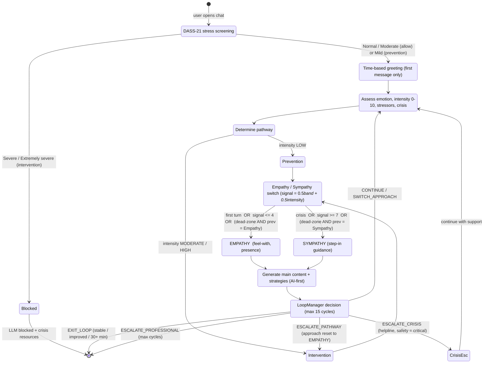
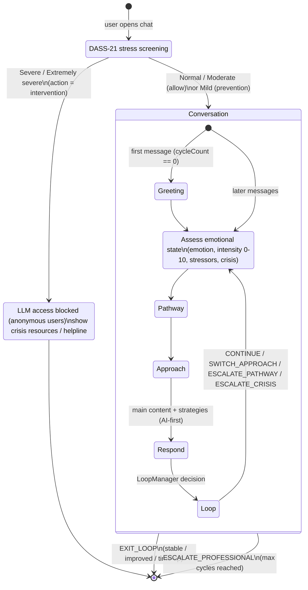
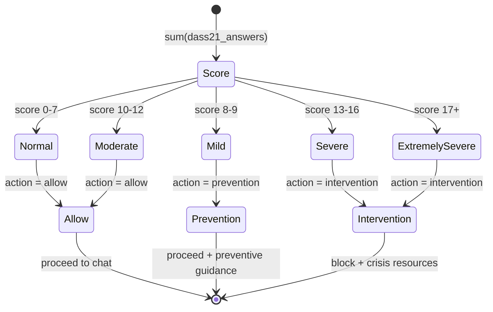
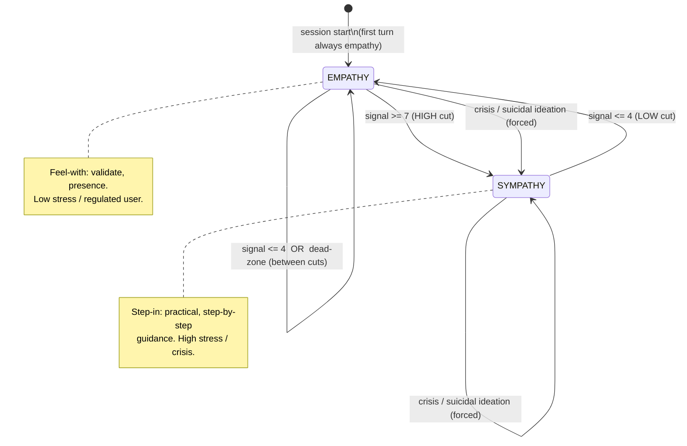
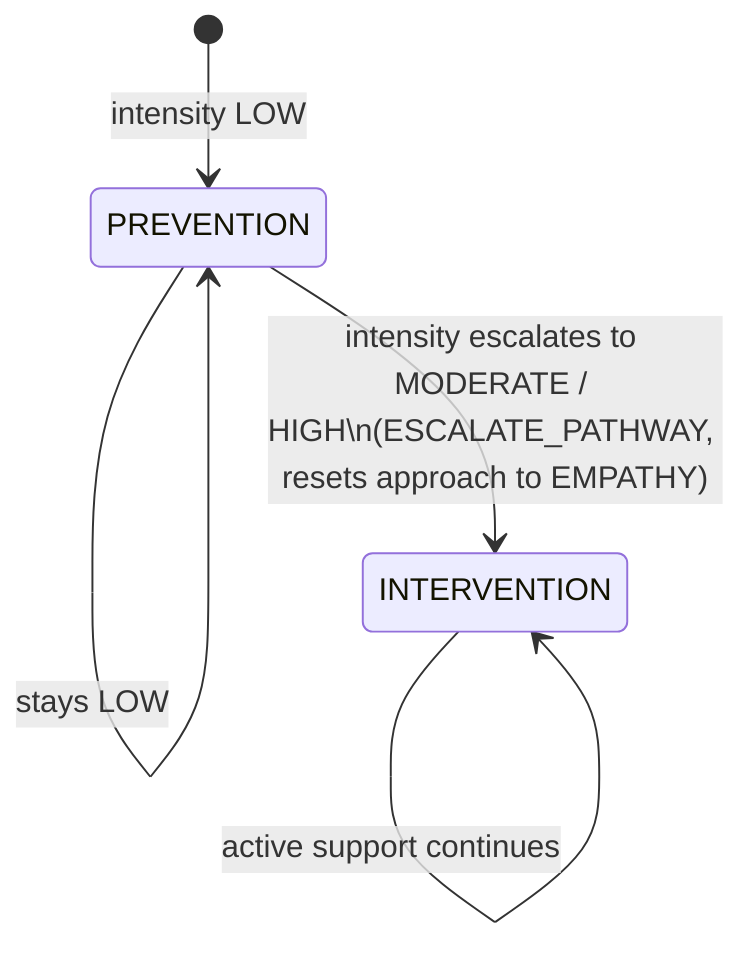
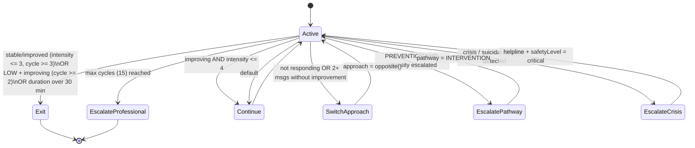

# RadAI — State Charts

State machines for the RadAI (Reassuring Affective Domain) mental-health chatbot, derived from the
backend implementation. Diagrams use [Mermaid](https://mermaid.js.org/) `stateDiagram-v2` and render
on GitHub, in VS Code (Mermaid preview), and in most Markdown tools.

Source of truth:
- `ChatbotFlowEngine` / `FlowWithAIService` — per-message orchestration
- `PreLLMScreeningController` + `PreLLMScreeningInterceptor` — DASS screening gate
- `MonitoringAndScreeningService` — emotional assessment + pathway
- `ApproachSwitchPolicy` — empathy ↔ sympathy switch (the core FYP mechanic)
- `LoopManager` — conversation loop decisions

---

## 0. Combined state chart (single view)

The whole system as one per-message pipeline: **screening gate → greeting → assess → pathway →
approach (empathy/sympathy) → respond → loop**. The empathy↔sympathy hysteresis is shown as guards
on the `Approach` branches; `prev` = the mode held coming into the turn.

`signal = 0.5 × bandBaseline + 0.5 × intensity`  (band: Normal=1 … Extremely severe=9);
cutoffs `HIGH=7`, `LOW=4`.

The sections below break this single chart into its individual machines for detail.

---

## 1. Top-level session lifecycle

> The screening gate is enforced for **anonymous** users by `PreLLMScreeningInterceptor`
> (`action = intervention` → HTTP 403). Registered/authenticated users proceed regardless.

---

## 2. DASS screening gate

Stress subscale score → band → action (`PreLLMScreeningController`).

---

## 3. Empathy ↔ Sympathy switch  *(core FYP mechanic)*

`ApproachSwitchPolicy`. Direction: **HIGH** stress/intensity → **SYMPATHY** (step in, guide);
**LOW** → **EMPATHY** (gentle presence). Hysteresis (two cutoffs + dead-zone) prevents flip-flopping.

**Signal** (0–10, "both combined"):
`signal = 0.5 × bandBaseline + 0.5 × messageIntensity`
where `bandBaseline`: Normal=1, Mild=3, Moderate=5, Severe=7, Extremely severe=9
(if the DASS band is unknown, `signal = messageIntensity` alone).

**Cutoffs:** `HIGH_CUT = 7.0`, `LOW_CUT = 4.0`.

The four outcomes: **switch E→S**, **switch S→E**, **stay E**, **stay S** — exactly the dead-zone
behaviour verified in `ApproachSwitchPolicyTest`.

---

## 4. Pathway machine

`MonitoringAndScreeningService.determinePathway` + `LoopManager` escalation.

> Note: on `ESCALATE_PATHWAY` the `LoopManager` resets the approach to **EMPATHY** for the new
> pathway; the empathy↔sympathy machine (§3) then re-evaluates from there on the next turn.

---

## 5. Conversation loop decisions

`LoopManager.makeLoopDecision`. Evaluated once per cycle (`maxCycles = 15`).

---

## Legend / mapping to code

| State chart | Code |
|---|---|
| §1 lifecycle | `ChatbotFlowEngine.processUserMessage` |
| §2 screening | `PreLLMScreeningController.screen` |
| §3 empathy↔sympathy | `ApproachSwitchPolicy.decide` |
| §4 pathway | `MonitoringAndScreeningService.determinePathway` |
| §5 loop | `LoopManager.makeLoopDecision` |
